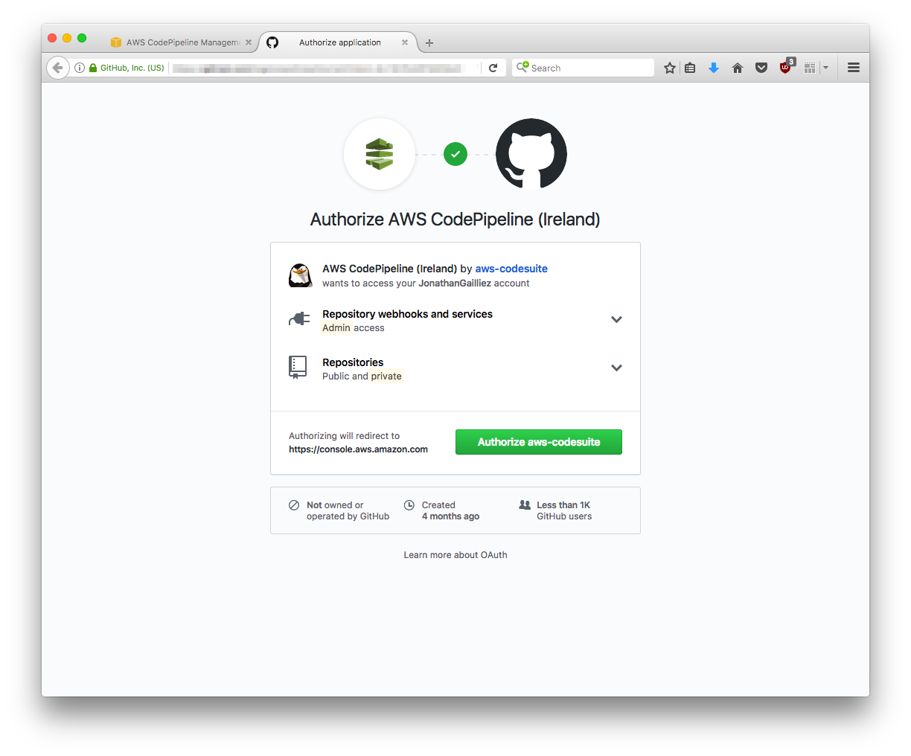
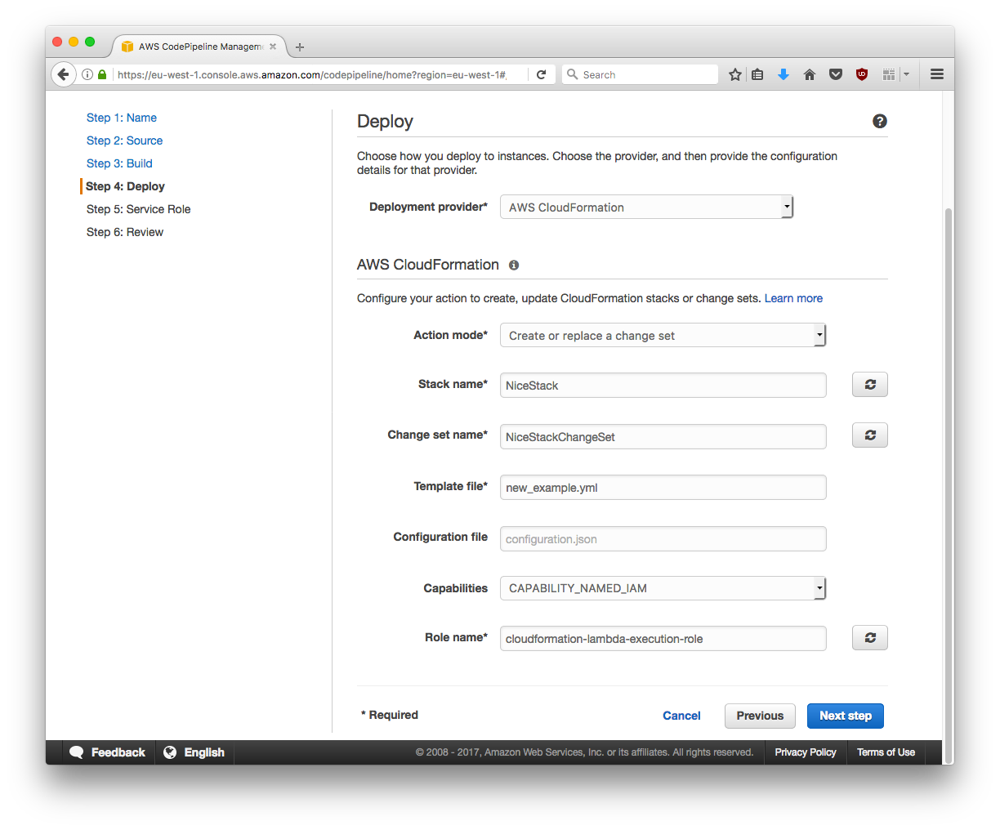

# AWS API Gateway using AWS Lambda

The goal of this sample is to show my attemp at creating some continuous delivery process for AWS API Gateway and the issue I'm facing. This is achieved using AWS S3, CodePipeline, CodeBuild and CloudFormation.

Everything that's mentioned in this tutorial is considered in the eu-west-1 region.

Prior to trying the example, fork the repo.

The issue I'm facing when deploying is that the Lambdas are properly updated but not the API definition. From what I understand, the AWS::ApiGateway::Deployment are immutable resources which means that for each deployment of the API I need to create a new AWS::ApiGateway::Deployment resource. This is not practical at all because for each of this AWS::ApiGateway::Deployment I have a new Invoke URL. This is not acceptable since I would have to either change my DNS record to the newly deployed API invoke URL or ask our API users to change the URL in their applications.

What I would like is to be able to change the API definition and the Lambdas implementations without my API users having to change anything in their applications.

How can I achieve this behavior?

## How to deploy this API using AWS CodePipeline

### S3 Bucket for the CodeBuild artifacts

First thing is to create a S3 bucket in which CodeBuild will be able to upload the artifact it computes.

You can find a tutorial at: http://docs.aws.amazon.com/AmazonS3/latest/gsg/CreatingABucket.html

### Update your buildspec.yml

The file buildspec.yml is used to build the project, install dependencies, process the CloudFormation template,... In this file, you need to replace the YOUR_BUCKET_NAME by the name of the bucket created at the previous step.

### Create your Pipeline in CodePipeline

Go to the CodePipeline home page: https://eu-west-1.console.aws.amazon.com/codepipeline/home?region=eu-west-1#/dashboard

Click the "Create pipeline" button.

Enter the name of your Pipeline. It's "NiceAPI-Builder" in the example.

#### Source

Select the source of the Pipeline. It's GitHub in our current case.

Allow AWS CodePipeline to access your GitHub account.

Select the repository and the branch from which CodePipeline will get the sources. Each new commit in this branch will trigger the execution of the Pipeline.

#### Build

Select AWS CodeBuild as the build provider, select "Create a new build project" and enter a project name. It's NiceAPI in our current case.

Select the operating system, the runtime and its version into which the project will be build. Ubuntu and Python 2.7.12 in our current case. Then click the "Save build project".

Wait for the project to be saved and click the "Next step" button.

#### Deploy

We will use CloudFormation as the deployment provider. Fill the form as displayed in the screenshot below. Then click the "Next step" button.

Pay attention to the Role name you enter at this point, you'll need to grant him the permission to putObject in the S3 bucket created at the beginning of the tutorial.

If you don't, you'll encounter the error:

	Unable to upload artifact None referenced by Code parameter of APILambdaFunction resource. An error occurred (AccessDenied) when calling the PutObject operation: Access Denied

#### Service Role

You must create a service role for CodePipeline to be able to use resources in your account. Then click the "Next step" button.

The Pipeline is now created but still lack one action.

#### Deploy action

One action is still missing in your Pipeline. The action that actualy apply the ChangetSet computed to the CloudFormation Stack. Click the "Edit" button.

Click the "+ stage" button, name the stage as "Deploy" and then click the "+ action" button.

Configure the action as displayed in the screenshots below.

Click the "Add action" button.

Click the "Save pipeline changes" button.

#### S3 permission

As said previously, you need to grant the permission to putObject in the S3 bucket created at the beginning of the tutorial to the role used for deployment.

#### Use the Pipeline

To deploy the API using the Pipeline, you need to click the "Release change" button. This is only needed if you want to trigger the release manually. The Pipeline will be trigerred at each commit in the future.

#### API Gateway

Once the Pipeline has completed its deployment, you can see your newly created API at: https://eu-west-1.console.aws.amazon.com/apigateway/home?region=eu-west-1#/apis

You can see the resources created.

You can see the API deployment and API stage created.

## The issue with subsequent deployments

You can find the invoke URL in the APIStage in the AWS console.

Let's test our API using curl:

	curl -X GET -H "Content-Type: application/json" -H "X-API-key: some_api_key" INVOKE_URL/collection/SOME_RANDOM_ID/items
	{"code": 200, "results": "A nice API"}

Let's have a look at the CloudWatch logs. Among other things, we can see:

	Launched with event:
	{
	    "body": {},
	    "headers": {
	        "Content-Type": "application/json",
	        "Via": "*********",
	        "CloudFront-Is-Desktop-Viewer": "true",
	        "CloudFront-Is-SmartTV-Viewer": "false",
	        "CloudFront-Forwarded-Proto": "https",
	        "X-Forwarded-For": "******, ******",
	        "CloudFront-Viewer-Country": "BE",
	        "Accept": "*/*",
	        "User-Agent": "curl/7.51.0",
	        "X-Amzn-Trace-Id": "Root=******",
	        "Host": "******.execute-api.eu-west-1.amazonaws.com",
	        "X-Forwarded-Proto": "https",
	        "X-Amz-Cf-Id": "******",
	        "CloudFront-Is-Tablet-Viewer": "false",
	        "X-Forwarded-Port": "443",
	        "X-API-key": "some_api_key",
	        "CloudFront-Is-Mobile-Viewer": "false"
	    },
	    "params": {
	        "collectionId": "SOME_RANDOM_ID"
	    },
	    "method": "GET",
	    "query": {}
	}

Now I replace the content of the example.yml file by the content of the second_example.yml . In second_example.yml I remove the requestTemplates from the methods definitions.
I then commit the changes. I push them to the repo. It triggers the Pipeline and I wait for the API to be deployed again.

When I test the API again using curl, it gives me the same result as previously in the CloudWatch logs:

	Launched with event:
	{
	    "body": {},
	    "headers": {
	        "Content-Type": "application/json",
	        "Via": "*********",
	        "CloudFront-Is-Desktop-Viewer": "true",
	        "CloudFront-Is-SmartTV-Viewer": "false",
	        "CloudFront-Forwarded-Proto": "https",
	        "X-Forwarded-For": "******, ******",
	        "CloudFront-Viewer-Country": "BE",
	        "Accept": "*/*",
	        "User-Agent": "curl/7.51.0",
	        "X-Amzn-Trace-Id": "Root=******",
	        "Host": "******.execute-api.eu-west-1.amazonaws.com",
	        "X-Forwarded-Proto": "https",
	        "X-Amz-Cf-Id": "******",
	        "CloudFront-Is-Tablet-Viewer": "false",
	        "X-Forwarded-Port": "443",
	        "X-API-key": "some_api_key",
	        "CloudFront-Is-Mobile-Viewer": "false"
	    },
	    "params": {
	        "collectionId": "SOME_RANDOM_ID"
	    },
	    "method": "GET",
	    "query": {}
	}

The expected result is:

	Launched with event:
	{
	}

since I removed the requestTemplates from the method definitions in the API. This means that the API definition is not updated from one Pipeline execution to the other.

How can I achieve this behavior?

## Interesting reads

* https://kennbrodhagen.net/2015/12/06/how-to-create-a-request-object-for-your-lambda-event-from-api-gateway/
* https://forums.aws.amazon.com/thread.jspa?messageID=750845&#750845

